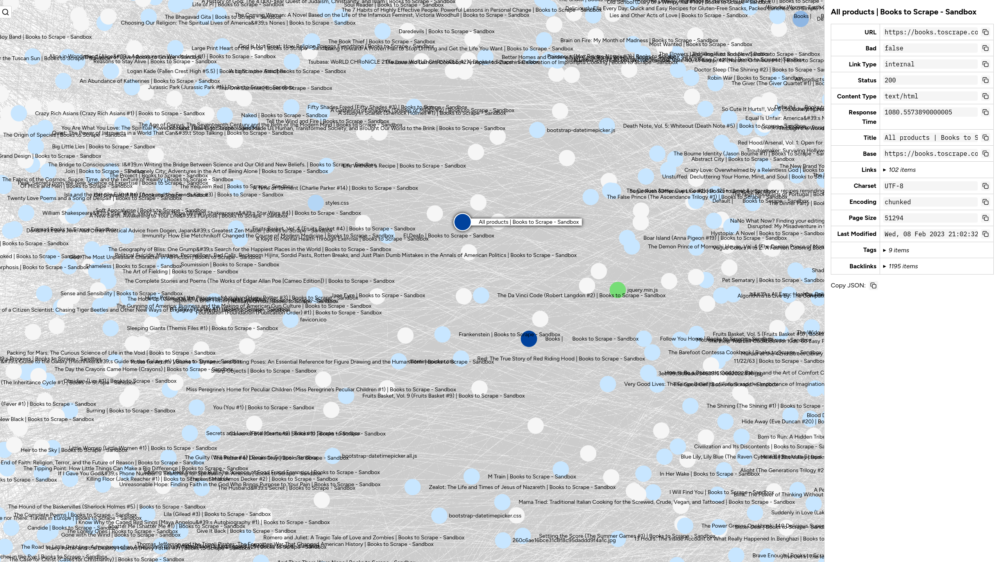

# Cartographer

A CLI web spider that crawls a website and generates a self-contained, interactive network graph report.



## Features

- Crawls all internal links from one or more seed URLs
- Checks external links for validity
- Extracts links from HTML and CSS files
- Tags each URL with metadata: content type, status code, response time, page size, encoding, cache headers, and more
- Generates a self-contained HTML report with an interactive, filterable network graph

## Requirements

- Node.js 18+

## Quick start

```bash
npm ci

node src/index.js https://example.com/
```

The report is saved to `dist/` and opened automatically in your browser.

## All options

```
node src/index.js --help
```

## Configuration

To customize default settings, edit `src/config.js`. All CLI flags take precedence over the values in that file.

CLI string flags support substitution keys: `{{url}}`, `{{host}}`, and `{{timestamp}}`.
